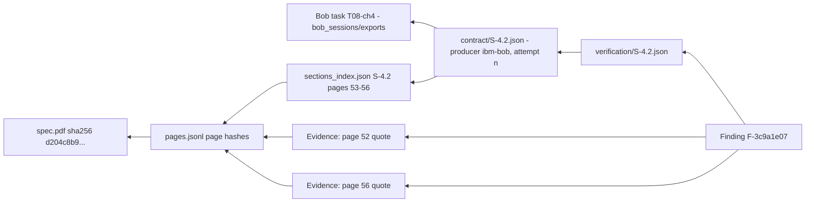

# Data Governance and Lineage: SpecProof

Version 1.0 · 2026-09-25

## 1. Purpose and scope
This document defines what data SpecProof uses, under what terms, how that data is stored and shared, and how every output traces back to its inputs. It covers:
- the third-party sources;
- generated artifacts;
- AI-generated content, from IBM Bob and Claude Code;
- session logs submitted to the hackathon.

## 2. Data inventory

| Asset | Owner | License / terms | Obtained via | Stored where | Committed to repo? | Integrity |
|---|---|---|---|---|---|---|
| UniFi Access API PDF (194 pp.) | Ubiquiti Inc. | Proprietary vendor documentation | Pinned URL (community mirror at commit `426e948b`) | `artifacts/work/spec.pdf` | **No** | SHA-256 `d204c8b9…a534` |
| Page text (`pages.jsonl`) | Derived from Ubiquiti's PDF | Same as the PDF | `specproof ingest` | `artifacts/work/` | **No** | Per-page SHA-256 in manifest |
| Community OpenAPI | YuDefine | MIT | Pinned URL | `artifacts/work/` | **No** (not needed; fetched) | SHA-256 `629c809c…3e24` |
| `py-unifi-access` | imhotep | MIT | git, commit `6466978` | `artifacts/work/py-unifi-access/` | **No** | Commit hash |
| Section index | Generated | MIT (ours) | `specproof segment` | `artifacts/` | Yes (titles, pages, hints and hashes only) | Content hash |
| Contracts | Generated by IBM Bob, verified by our engine | MIT (ours), with short quotes from the source | Bob `spec-auditor` | `artifacts/contract/` | Yes | Content hash + manifest |
| Verification, findings, metrics, report | Generated | MIT (ours) | CLI | `artifacts/` | Yes | Content hash + manifest |
| Bob session exports and screenshots | Us | Submitted as hackathon evidence | Bob export | `bob_sessions/` | Yes (after scrubbing) | — |
| Hand-audit sheets | Us | MIT | Manual | `eval/audit/` | Yes | — |

## 3. Usage rules

| Rule | Enforcement |
|---|---|
| R1. Third-party documents and full text are never committed | `.gitignore` covers `artifacts/work/`; test `GOV-001` fails if any `*.pdf` or `pages.jsonl` is tracked |
| R2. Quotes from the source are short: 12–200 characters each, only as many as needed to evidence a claim | Pydantic validator on `Citation.quote`; test `GOV-002` |
| R3. No personal data. The PDF's samples use placeholder data (e.g. names "H"/"L", masked tokens `wHFmHR******kD6wHg`, `example@*.com`); we copy only what a citation requires | Review in T13 |
| R4. No live API calls or credentials. SpecProof never contacts a UniFi device | No HTTP client outside `sources/fetch.py`; test `GOV-003` greps `src/` for network imports outside fetch |
| R5. Secrets scanning on every commit and on the session exports | gitleaks in pre-commit + CI; `gitleaks detect --source bob_sessions` before committing session exports (DEMO_AND_SUBMISSION §5) |
| R6. Blind extraction. The community spec is only read after contracts are frozen | Skill + mode instructions; `artifacts/work/community_openapi.yaml` is fetched but excluded in the extraction mode's rules; the compare stage runs only after `classify` |
| R7. Third-party findings are stated neutrally and offered upstream (issue or PR), never published as accusations | Report wording guideline §7 |

## 4. Lineage model
Every artifact written by the CLI appends a record to `artifacts/manifest.json`:

```json
{
  "artifact": "artifacts/verification/S-4.2.json",
  "sha256": "…",
  "stage": "verify",
  "producer": {"kind": "deterministic", "tool": "specproof", "version": "0.1.0", "rules_version": "v1"},
  "inputs": [
    {"path": "artifacts/contract/S-4.2.json", "sha256": "…"},
    {"source_id": "unifi_spec_pdf", "sha256": "d204c8b9…", "pages": [53, 54, 55, 56]}
  ],
  "created_at": "2026-09-26T10:14:03Z"
}
```

AI-produced artifacts (contracts, the conformance mapping) record `producer.kind: "ibm-bob"`, plus `mode`, `prompt_version`, `attempt` and `bob_task_ref`. The `bob_task_ref` links to the task ID in `bob_sessions/INDEX.md`, whose exported session shows the actual interaction.

### 4.1 Lineage graph: from finding back to source



Any number in the README, slides or video resolves to `metrics.json`. `metrics.json` resolves to `verification/*` and `findings/*`, and those resolve to page quotes in a hash-pinned PDF.

## 5. AI-generated content governance

| Tool | Allowed to produce | Not allowed | Record |
|---|---|---|---|
| IBM Bob 2.0 (Agent, Plan, spec-auditor) | Product code, tests, contracts, conformance mapping | Changing thresholds or protected paths during extraction; certifying its own output | `bob_sessions/` + commits |
| Claude Code | Review notes, adversarial tests on request, second-auditor votes | Product code in `src/`, contracts, thresholds | `docs/AI_USAGE_LOG.md` |
| Claude (chat, pre-event) | Planning documents and configuration in this kit | Product code | `docs/AI_USAGE_LOG.md` row 1 |

## 6. Versioning and change control
- **`schema_version`** is in every JSON artifact. A breaking change bumps it, and the loader rejects mismatches.
- **`rules_version`** labels the verifier. Any change to `verify/` bumps it and invalidates cached verification results.
- **`prompt_version`** is set in the skill (e.g. `extract-v1`). If the skill's procedure changes, bump it; contracts record which version produced them.
- **Protected paths** (AGENTS.md §8) cannot change in the same task as extraction, and `make guard` enforces this.

## 7. Communication of third-party findings
- Use neutral wording: "the document's sample on page 56 uses a value not in the enum defined on page 52." Avoid wording like "Ubiquiti's doc is broken."
- Community-spec discrepancies are phrased as differences from the PDF, with the PDF citation. Where appropriate, we open an issue or PR on the community repo, which invites corrections.
- Client findings are delivered as a runnable test (`test_sample_replay.py`) the maintainer can execute themselves.

## 8. Retention and deletion
`artifacts/work/` is disposable and recreated by `make fetch`. Committed artifacts are retained with the repo. To remove any quote, delete the contract item and re-run the pipeline; lineage records the change.

## 9. Hackathon compliance checklist
- [ ] Repo public, MIT license, original work
- [ ] No third-party documents or full text committed (GOV-001 green)
- [ ] Files where Bob 2.0 assisted are identifiable (commits + INDEX)
- [ ] Screenshots of Bob task session summaries in `bob_sessions/screenshots/`
- [ ] No credentials anywhere (gitleaks green)
- [ ] Source list with licenses in this document and in `sources/sources.lock.yaml`
