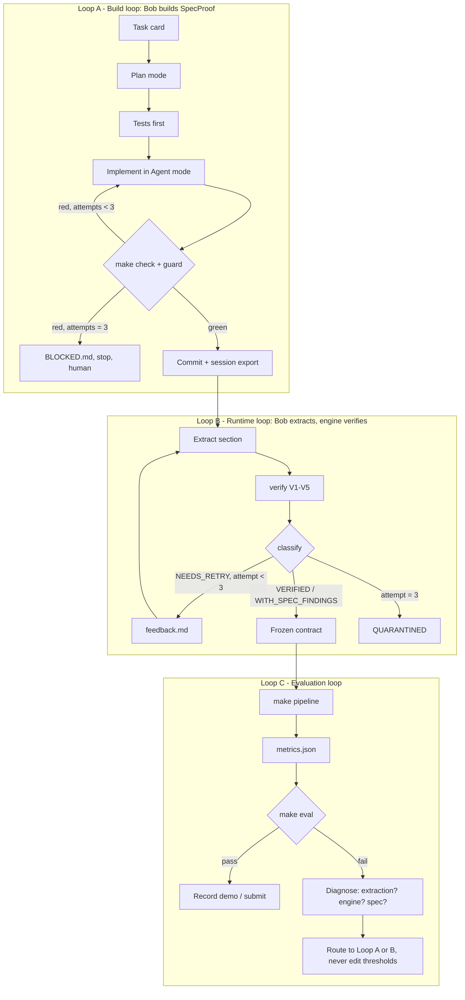

# Loop Engineering: SpecProof

Version 1.0 · 2026-09-25

SpecProof runs three nested loops. Each one has an **oracle** (who decides "done"), a **budget** (when to stop), **telemetry** (what gets recorded), and **guards** (what the agent may not do to make the loop "succeed").



## Loop A: Build loop (engineering the engine)

| Property | Definition |
|---|---|
| Unit of work | One task card from `IMPLEMENTATION_PLAN.md` = one Bob task |
| Oracle | `make check` (ruff, mypy --strict, pytest with the coverage gate) **and** `make guard` |
| Budget | 3 fix attempts per distinct failure; the whole task time-boxed to its estimate × 1.5 |
| On budget exhaustion | Write `review/BLOCKED.md` (error, attempts, hypothesis) and stop. The human decides: simplify, cut, or ask Claude Code for a review |
| Telemetry | Commit per task (`T0X: …`), CHANGELOG line, Bob session export + screenshot |
| Guards | Tests are written *before* implementation and may not be weakened; thresholds are protected; one task in flight at a time |

**Per-task ritual (the full prompts are in `prompts/`; start every task with `prompts/00-session-bootstrap.md`):**
1. `git rev-parse HEAD > .specproof_task_base`: record the base commit for the guard.
2. **Plan mode:** "Read AGENTS.md and task card T0X. Restate the goal, files, and test IDs in ≤ 15 lines. Do not edit."
3. **Agent mode:** "Implement T0X test-first per the plan. Run make check until green. Stop after 3 failed attempts on the same error."
4. Human: read the diff (2 minutes) → `make guard` → commit → export session → screenshot → INDEX row.
5. **Optional, only for risky tasks (T05, T06, T10):** Claude Code review → `review/REVIEW_T0X.md` → fixes go back to Bob as a follow-up task.

**Checkpoints:** before each Agent run, make sure Bob's checkpoint is on. If an attempt goes sideways, **roll back to the checkpoint** instead of patching on top of it. Rollback is cheaper than debugging, and it makes a good line in the session evidence.

## Loop B: Runtime extraction loop (the product's core)

| Property | Definition |
|---|---|
| Unit of work | One section (`S-x.y`) |
| Producer | IBM Bob in `spec-auditor` mode, via subagents per chapter |
| Oracle | The deterministic verifier (V1–V5) + classifier (architecture §6–7). **Never the model.** |
| Budget | Maximum 3 attempts per section (1 initial + 2 retries). Retries only touch failing items |
| Convergence signal | Count of extraction-category issues per section must strictly decrease between attempts. If it does not, stop early → QUARANTINED (saves Bobcoins) |
| Terminal states | VERIFIED, VERIFIED_WITH_SPEC_FINDINGS, QUARANTINED |
| Telemetry | `verification/<id>.json` per attempt (kept as `…_attempt<n>.json`), `status.json`, loop funnel metrics |
| Guards | The spec-auditor mode may only edit `artifacts/contract/` and `artifacts/conformance/`; `make guard` runs after every loop iteration; the extractor never sees the community spec |

### Feedback file contract (`artifacts/feedback/<section_id>.md`)
Machine-generated, deterministic, and limited to what failed:

```markdown
# Feedback: S-4.2 (attempt 1 → 2)
Fix ONLY the items below. Do not change items that passed.

## visit_reason (location: body)
- V2_ROW_MISMATCH: claimed required=false, but the row on page 53 reads `visit_reason  T  String`.
  Evidence: page 53, "visit_reason             T               String"

## user_email (location: body)
- V2_CITATION_NOT_FOUND on page 55. Closest text on pages 53-56 (page 54):
  "user_email              F           String      Email of the user."
```

The closest-match hint comes from rapidfuzz. It only **helps the retry**; it never affects pass or fail (test VER-012).

### Why the loop cannot be gamed
- The extractor cannot edit the verifier, the tests or the thresholds (mode file regex + guard).
- A section cannot pass by deleting fields, because V5 (row coverage) catches dropped rows.
- A section cannot pass by "fixing" the document, because `V2_SAMPLE_NOT_VERBATIM` requires every sample line to appear verbatim, in order, in the section text.
- Spec findings require both sides to be grounded, so an extraction error cannot masquerade as a document defect.

### Running Loop B in Bob (operational)
1. `/sp-extract 3` → Bob delegates chapter 3's sections to subagents and runs `specproof verify --chapter 3`.
2. Repeat for each chapter. Run chapters **in parallel** as background tasks where Bob allows it; verify results as they land.
3. `/sp-loop` → one iteration over all NEEDS_RETRY sections.
4. `/sp-loop` again (second and final retry).
5. `specproof classify` → everything is now terminal. Commit artifacts: `T08: extraction complete (loop x2)`.

## Loop C: Evaluation loop (release quality)

| Property | Definition |
|---|---|
| Oracle | `make eval` against `eval/thresholds.yaml` (committed before extraction) |
| Cadence | After T08, after T10, after T12, and immediately before recording the demo and before submitting |
| On failure | Diagnose the layer, then route: extraction issue → Loop B (if the budget remains); engine bug → Loop A (new task card `T0Xb`); a genuine limitation → document it in the report's limitations section. **Never** edit thresholds |
| Determinism check | `make pipeline` twice → compare artifact hashes (E2E-002/R03) |
| Human checkpoint | Blind audit (EVALUATION §4) is part of Loop C. Run it once, and never re-draw the sample |

## Anti-patterns we explicitly forbid

| Anti-pattern | Why it's harmful | Prevention |
|---|---|---|
| "Retry until green" without feedback | Burns Bobcoins; converges on noise | Retries require a feedback file; attempts are capped |
| LLM self-grading ("I verified the quotes") | Not verification | Rules file 02; the verifier is the only oracle |
| Editing tests or thresholds to pass | Reward hacking | Protected paths + guard + git history |
| Re-extracting VERIFIED sections | Wastes budget; risks regressions | The skill rule and command instructions skip VERIFIED |
| Mixing engine changes with extraction | Results no longer attributable | One task, one layer (AGENTS.md §8) |
| Hand-editing artifacts | Breaks lineage | GOV-004 manifest hash check |
