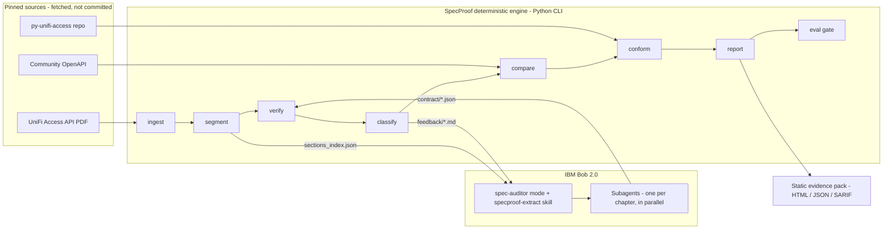
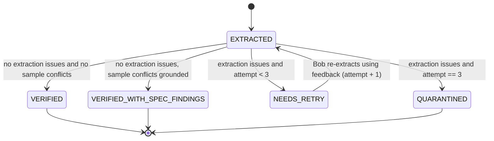

# Technical Architecture Specification: SpecProof

Version 1.0 · 2026-09-25 · This document covers the project architecture, the system design, and the project tree.

## 1. Architectural principles

1. **AI proposes, deterministic code decides.** LLM work, done by IBM Bob, is confined to *extraction* and *code-to-contract mapping*. Every verdict is computed by pure Python.
2. **Evidence or it didn't happen.** Every claim carries a document citation (page + verbatim quote) or a code citation (file + line).
3. **Bounded self-correction.** Failures produce machine-generated feedback. Retries are capped at 2 per section, and anything still failing is quarantined, never silently accepted.
4. **Separate extraction error from document defect.** A conflict between two *grounded* statements of the document is a finding about the document, not an extraction failure.
5. **Reproducible and offline.** Pinned sources, deterministic serialization, no network after `fetch`.
6. **Blind extraction.** The extractor never sees third-party interpretations (the community OpenAPI) of the same document. This prevents anchoring.

## 2. System context



## 3. Pipeline stages

| # | Stage | Producer | Input | Output (path) | Committed? |
|---|---|---|---|---|---|
| S0 | fetch | deterministic | `sources/sources.lock.yaml` | `artifacts/work/{spec.pdf, community_openapi.yaml, py-unifi-access/}` | No |
| S1 | ingest | deterministic | `spec.pdf` | `artifacts/work/pages.jsonl`, `artifacts/manifest.json` | manifest only |
| S2 | segment | deterministic | `pages.jsonl` | `artifacts/sections_index.json` (IDs, titles, kinds, page ranges, hints; no full text) | Yes |
| S3 | extract | **IBM Bob** (spec-auditor, subagents) | PDF pages + `sections_index.json` (+ feedback) | `artifacts/contract/<section_id>.json` | Yes |
| S4 | verify | deterministic | contract + pages | `artifacts/verification/<section_id>.json` | Yes |
| S5 | classify / loop | deterministic | verification results | `artifacts/status.json`, `artifacts/feedback/<id>.md`, `artifacts/findings/spec.json` | Yes |
| S6 | export + compare | deterministic | verified contracts + community spec | `artifacts/openapi.specproof.yaml`, `artifacts/findings/community.json` | Yes |
| S7 | map | **IBM Bob** (spec-auditor) | client repo + contract | `artifacts/conformance/mapping.yaml` | Yes |
| S8 | conform | deterministic | client repo + mapping + contract | `artifacts/findings/conformance.json`, `artifacts/conformance/test_sample_replay.py` | Yes |
| S9 | report | deterministic | all of the above | `artifacts/report/index.html`, `findings.json`, `findings.sarif`, `metrics.json` | Yes |
| S10 | eval | deterministic | `metrics.json` + `eval/thresholds.yaml` | exit code + `artifacts/eval_result.json` | Yes |

## 4. Component design (`src/specproof/`)

| Module | Responsibility | Key public functions |
|---|---|---|
| `config.py` | Paths, constants, schema/prompt versions | `Paths.from_root(root)` |
| `models/contract.py` | Pydantic: `Citation`, `FieldSpec`, `Sample`, `ContractSection` | `ContractSection.load(path)` |
| `models/verification.py` | `Issue`, `VerificationResult`, `SectionStatus` | — |
| `models/findings.py` | `Evidence`, `Finding`, stable finding IDs | `Finding.make_id(...)` |
| `models/manifest.py` | Lineage records | `Manifest.record(stage, inputs, outputs, producer)` |
| `sources/fetch.py` | Download and hash-verify pinned sources; git checkout at commit | `fetch_all(lock)` |
| `ingest/extractors.py` | `TextExtractor` protocol; `PdftotextExtractor`, `PdfplumberExtractor` | `extract_pages(pdf) -> list[Page]` |
| `ingest/segment.py` | Heading detection, TOC skipping, kind classification, hints | `segment(pages) -> list[SectionIndexEntry]` |
| `util/text.py` | NFKC normalization, whitespace collapse, row tokenization | `norm(s)`, `row_tokens(line)` |
| `verify/grounding.py` | V2 citation grounding, V2b row consistency, V2c enum grounding | `check_citation(...)`, `check_row(...)` |
| `verify/samples.py` | V3: sample parsing (curl `--data-raw`), JSON Schema build, validation, error mapping | `validate_samples(section)` |
| `verify/structure.py` | V1 schema validity, V4 path/method grounding, V5 coverage | — |
| `verify/engine.py` | Runs V1–V5 in fixed order; pure | `verify_section(section, pages, index_entry)` |
| `loop/classify.py` | State machine (§7); splits extraction issues from spec findings | `classify(result, attempt)` |
| `loop/feedback.py` | Renders `feedback/<id>.md` with reason codes, evidence and closest-match hints | `render_feedback(result, pages)` |
| `compare/openapi_export.py` | Verified contract → OpenAPI 3.1 | `export(contracts)` |
| `compare/community.py` | Path normalization + field-level diff vs community spec | `diff(ours, theirs)` |
| `conformance/inventory.py` | AST scan of client for endpoint literals and HTTP methods | `scan_endpoints(pkg_dir)` |
| `conformance/models.py` | Pydantic model introspection (`model_fields`) vs contract | `diff_model(model, section)` |
| `conformance/replay.py` | Generates and runs sample-replay pytest file | `generate(mapping, contracts)`, `run()` |
| `report/metrics.py` | All metrics in `EVALUATION_FRAMEWORK.md`, with explicit denominators | `compute(state) -> Metrics` |
| `report/html.py` + `templates/` | Self-contained HTML (Jinja2, inline CSS/JS) | `render(state)` |
| `report/sarif.py` | SARIF 2.1.0 export for code findings | `to_sarif(findings)` |
| `evalgate.py` | Threshold comparison | `gate(metrics, thresholds) -> GateResult` |
| `cli.py` | Typer app wiring; the only place with I/O orchestration | — |

## 5. Data contracts

All JSON is written with sorted keys and 2-space indentation. Every schema carries `schema_version`.

### 5.1 Citation
```json
{"page": 14, "quote": "first_name              T           String"}
```
- `page`: 1-based PDF page. `quote`: verbatim substring of that page's text, 12–200 characters after normalization.

### 5.2 FieldSpec
```json
{
  "name": "visit_reason",
  "location": "body",
  "required": true,
  "type": "string",
  "type_raw": "String",
  "enum": ["Interview", "Business", "Cooperation", "Others"],
  "enum_citation": {"page": 52, "quote": "Visit reason: enum reason {Interview,Business,Cooperation,Others}"},
  "description": "Visit reason.",
  "example": "Interview",
  "min_version": null,
  "schema_ref": null,
  "citation": {"page": 53, "quote": "visit_reason             T               String"}
}
```
- `location` ∈ `header | path | query | body | response`
- `type` ∈ `string | integer | number | boolean | object | array | unknown`
- `required`: `true | false | null` (null = no Required column)

### 5.3 ContractSection
```json
{
  "schema_version": 1,
  "section_id": "S-4.2",
  "kind": "endpoint",
  "title": "Create Visitor",
  "method": "POST",
  "path": "/api/v1/developer/visitors",
  "permission_key": "edit:visitor",
  "citations": {"path": {"page": 53, "quote": "Request URL: /api/v1/developer/visitors"}},
  "fields": [ /* FieldSpec[] */ ],
  "definitions": [],
  "samples": {
    "request":  {"raw": "{ ... }", "citation": {"page": 56, "quote": "\"visit_reason\": \"Interviemw\","}},
    "response": {"raw": "{ ... }", "citation": {"page": 54, "quote": "..."}}
  },
  "extraction": {"producer": "ibm-bob", "mode": "spec-auditor", "prompt_version": "extract-v1",
                 "attempt": 1, "bob_task_ref": "T08-ch4"}
}
```
Schema sections (`kind: schema`) use `definitions` (FieldSpec[]) and have no method or path. The page numbers above for §4.2 are illustrative except where listed in `VERIFIED_FACTS.md` (52, 56 and 63 are verified).

### 5.4 SectionIndexEntry (`sections_index.json`)
```json
{"section_id": "S-4.2", "chapter": 4, "number": "4.2", "title": "Create Visitor", "kind": "endpoint",
 "page_start": 53, "page_end": 56, "method_hint": "POST", "path_hint": "/api/v1/developer/visitors",
 "text_sha256": "…"}
```

### 5.5 VerificationResult
```json
{"section_id": "S-4.2", "attempt": 1, "issues": [
  {"code": "V3_ENUM_VIOLATION", "severity": "error", "field": "visit_reason", "category": "sample_conflict",
   "message": "Request sample value 'Interviemw' not in enum", "evidence": {"page": 56, "quote": "…"}}],
 "counts": {"items": 14, "grounded": 14, "row_checked": 11, "row_ok": 11}}
```

### 5.6 Finding
```json
{"id": "F-3c9a1e07", "type": "SPEC_SELF_INCONSISTENCY", "severity": "high", "section_id": "S-4.2",
 "title": "Request sample violates documented enum for visit_reason",
 "evidence": [
   {"kind": "doc", "page": 52, "quote": "Visit reason: enum reason {Interview,Business,Cooperation,Others}"},
   {"kind": "doc", "page": 56, "quote": "\"visit_reason\": \"Interviemw\","}],
 "review": {"status": "CANDIDATE", "reviewer": null, "note": null}}
```
`id` = `"F-" + sha256(type|section_id|field|sorted evidence)[:8]`, which is stable across runs. `review.status` becomes `CONFIRMED` or `REJECTED` only through `eval/audit/findings_review.csv` (a human decision).

**Finding types:**
- Spec findings: `SPEC_SELF_INCONSISTENCY`, `SPEC_MALFORMED_SAMPLE`, `SPEC_SAMPLE_INCOMPLETE`
- Community findings: `COMMUNITY_REQUIRED_MISMATCH`, `COMMUNITY_TYPE_MISMATCH`, `COMMUNITY_ENUM_MISMATCH`, `COMMUNITY_MISSING_FIELD`, `COMMUNITY_EXTRA_FIELD`, `COMMUNITY_MISSING_ENDPOINT`
- Client findings: `CLIENT_UNDOCUMENTED_ENDPOINT`, `CLIENT_METHOD_MISMATCH`, `CLIENT_TYPE_MISMATCH`, `CLIENT_REQUIRES_UNDOCUMENTED_FIELD`, `CLIENT_SAMPLE_REJECTED`

## 6. Verification rule catalog (V1–V5)

The rules run in this exact order. **Category** decides the classification path in §7.

| Code | Rule | Category | Severity |
|---|---|---|---|
| `V1_SCHEMA_INVALID` | Contract JSON fails Pydantic validation | extraction | error |
| `V2_QUOTE_TOO_SHORT` | Normalized quote shorter than 12 characters | extraction | error |
| `V2_CITATION_NOT_FOUND` | Normalized quote is not a substring of the normalized cited page (the feedback includes the closest match found with rapidfuzz, for the retry) | extraction | error |
| `V2_CITATION_WRONG_PAGE` | Quote not on the cited page but found on another page of the section (the feedback suggests that page) | extraction | error |
| `V2_NAME_NOT_IN_QUOTE` | Field name does not appear in its own quote | extraction | error |
| `V2_ROW_MISMATCH` | A single-line table row starting with the field name exists, but its T/F token or type token disagrees with `required` / `type_raw` | extraction | error |
| `V2_ROW_NOT_FOUND` | No single-line row found (wrapped or multi-line row); row check skipped | info | info |
| `V2_ENUM_NOT_GROUNDED` | An enum value does not appear in `enum_citation.quote` (or the row quote) | extraction | error |
| `V2_SAMPLE_NOT_VERBATIM` | The non-empty normalized lines of a sample's `raw` do not appear, in order, as substrings of the normalized section lines (a subsequence match that tolerates page footers). This catches samples that were "cleaned" or "fixed" during extraction | extraction | error |
| `V3_SAMPLE_UNPARSEABLE` | Sample raw text is not valid JSON (strict `json.loads`) | sample_conflict | error |
| `V3_REQUIRED_MISSING` | Request sample omits a field documented `required: true` | sample_conflict | warning |
| `V3_TYPE_MISMATCH` | Sample value type disagrees with the documented type | sample_conflict | error |
| `V3_ENUM_VIOLATION` | Sample value not in the documented enum | sample_conflict | error |
| `V3_UNKNOWN_FIELD` | Sample contains a key absent from the contract's fields | sample_conflict | info |
| `V4_METHOD_MISMATCH` / `V4_PATH_MISMATCH` | Extracted method/path differ from the segmenter's deterministic hints (normalized) | extraction | error |
| `V5_COVERAGE_GAP` | The deterministic row detector found a table row name that is missing from the contract | extraction | error |

**Normalization** (`util/text.norm`): Unicode NFKC, straight quotes, collapse all whitespace runs to a single space, strip. Matching is case-sensitive.

**Row detection** (V2b, V5): within a section's text, a line matching `^\s*(?P<name>[A-Za-z_][\w.\[\]]*)\s{2,}(?P<req>T|F)\s{2,}(?P<type>[A-Za-z][\w\[\]]*)`. Header and body tables are delimited by the lines `Request Header`, `Request Body`, `Response Body`, `Query Parameters` and `Path Parameters`.

## 7. Classification state machine



**Grounded sample conflict rule:** a `sample_conflict` issue becomes a **spec finding** (not a failure) only if all three hold:
- the conflicting contract field has passed V2 and V2b/V2c;
- the sample citation has passed V2;
- there are no remaining extraction issues in the section.

Otherwise the section is retried, because the conflict may itself come from an extraction mistake. Quarantined sections are excluded from compare and conform, and are listed in the report with their last issues.

## 8. Conformance design (`py-unifi-access`)

1. **Inventory (C1).** Parse every `.py` file with `ast`. Collect `Constant` strings and `JoinedStr` f-strings containing `/api/v1/developer/`, and render f-string placeholders as `{}`. Infer the HTTP method from the enclosing call:
   - an attribute call named `get`, `post`, `put`, `delete` or `patch`; or
   - the first string argument (`"GET"`, …) to a request helper; otherwise `UNKNOWN`.

   Compare against verified contract paths, normalized: leading `/`, and `{anything}` replaced by `{}`. The spike in T10 confirms the client's actual call pattern before this is coded.
2. **Mapping (C2, Bob-assisted).** In the `spec-auditor` mode, Bob writes `artifacts/conformance/mapping.yaml`, with entries of the form `{section_id, model: "unifi_access_api.models.door.Door", json_path: "data[*]", code: {file, line}}`. A deterministic check confirms that `file:line` contains `class <ModelName>`.
3. **Model diff (C2).** Import the model and read `model_fields` (name, alias, `is_required()`, annotation). Compare against the contract response fields, which yields `CLIENT_TYPE_MISMATCH` and `CLIENT_REQUIRES_UNDOCUMENTED_FIELD`.
4. **Sample replay (C3).** Generate `test_sample_replay.py`: one test per mapping, which loads the document's response sample from the contract and calls `Model.model_validate(item)`. Run it with pytest in an isolated venv containing the client at its pinned commit. Each failure becomes a `CLIENT_SAMPLE_REJECTED` finding with the Pydantic error, the doc citation and the code citation. The generated file doubles as a patch we can offer upstream.

## 9. Report design
- A single self-contained `index.html`: inline CSS/JS, no external requests, and light/dark via `prefers-color-scheme`.
- Sections:
  - hero metrics, with denominators;
  - loop funnel (first pass → after retries → final);
  - findings, filterable by type and severity, each with evidence cards (page and quote block, or file:line);
  - endpoints table (status, attempts, items, grounding);
  - community diff;
  - conformance;
  - methodology;
  - limitations;
  - lineage (manifest hashes);
  - prior art.
- `findings.sarif` covers code findings, so it works with GitHub code scanning. `metrics.json` is the single source for every number in the README, slides and video.

## 10. CLI specification (`specproof`)

| Command | Options | Exit codes |
|---|---|---|
| `fetch` | `--lock sources/sources.lock.yaml` | 0 ok · 1 hash mismatch |
| `ingest` | `--extractor auto\|pdftotext\|pdfplumber` | 0 · 2 missing source |
| `segment` | — | 0 |
| `verify` | `--section ID` (repeatable), `--chapter N`, `--all` (default), `--report-only` (always exit 0; used by `make pipeline`) | 0 no extraction errors · 1 any extraction errors (unless `--report-only`) |
| `loop-status` | `--json` | 0 |
| `classify` | — | 0 |
| `export-openapi` | — | 0 · 1 export invalid |
| `compare` | `--community` | 0 |
| `conform` | `--client PATH` | 0 · 1 replay run error |
| `report` | — | 0 |
| `eval` | `--thresholds eval/thresholds.yaml` | 0 pass · 1 fail |
| `audit-sample` | `--n 40 --seed 20260926` | 0 (writes `eval/audit/audit_sample.csv`; refuses to overwrite an existing sample) |
| `audit-score` | — | 0 (joins verdicts with statuses; writes audited metrics) |
| `guard` | `--base <git ref>` (default: the commit at task start, stored in `.specproof_task_base`) | 0 clean · 1 protected path changed |

`make pipeline` = `ingest segment verify classify export-openapi compare conform report` (it deliberately does not run `fetch` or extraction).

## 11. Project tree

```
specproof/
├── AGENTS.md                      # system instructions for Bob (and imported by CLAUDE.md)
├── CLAUDE.md                      # Claude Code: reviewer/red-team role only
├── README.md                      # overview + generated results
├── START_HERE.md                  # step-by-step build guide
├── LICENSE                        # MIT
├── Makefile                       # setup check test-e2e fetch pipeline eval guard
├── pyproject.toml                 # deps, ruff, mypy, pytest config, console script
├── .pre-commit-config.yaml        # ruff, mypy, gitleaks
├── .github/workflows/ci.yml       # make check on push
├── .gitignore  .bobignore
├── .bob/
│   ├── custom_modes.yaml          # spec-auditor mode
│   ├── rules/                     # 01-engineering, 02-truthfulness, 03-session-evidence
│   ├── skills/specproof-extract/SKILL.md
│   └── commands/                  # sp-extract, sp-verify, sp-loop, sp-report
├── sources/sources.lock.yaml      # pinned URLs + SHA-256 + commit
├── src/specproof/
│   ├── __init__.py  cli.py  config.py  evalgate.py
│   ├── models/      contract.py verification.py findings.py manifest.py
│   ├── sources/     fetch.py
│   ├── ingest/      extractors.py segment.py
│   ├── util/        text.py io_json.py hashing.py
│   ├── verify/      grounding.py samples.py structure.py engine.py
│   ├── loop/        classify.py feedback.py
│   ├── compare/     openapi_export.py community.py
│   ├── conformance/ inventory.py models.py replay.py
│   └── report/      metrics.py html.py sarif.py templates/report.html.j2
├── tests/
│   ├── conftest.py
│   ├── fixtures/    build_synthetic_pdf.py synthetic_spec.yaml mini_client/ community_min.yaml
│   ├── unit/        test_text.py test_models.py test_segment.py test_grounding.py test_samples.py …
│   ├── integration/ test_verify_engine.py test_loop.py test_compare.py test_conformance.py test_report.py
│   └── e2e/         test_pipeline_synthetic.py test_real_source.py (marker real_source)
├── artifacts/                     # committed outputs (work/ is gitignored)
│   ├── manifest.json  sections_index.json  status.json  metrics.json  eval_result.json
│   ├── contract/  verification/  feedback/  findings/  conformance/  report/
│   └── work/                      # spec.pdf, pages.jsonl, community_openapi.yaml, py-unifi-access/ (ignored)
├── eval/
│   ├── thresholds.yaml
│   └── audit/  protocol.md  audit_sample.csv  findings_review.csv  manual_baseline.csv
├── docs/                          # this document and all planning docs
├── review/                        # Claude Code reviews, BLOCKED.md, IDEAS.md
├── bob_sessions/                  # INDEX.md, exports/, screenshots/
└── demo/                          # landing page (index.html) linking the report
```

## 12. Technology stack

| Concern | Choice | Why |
|---|---|---|
| Language | Python 3.11+ | Matches the client under test (Pydantic); fastest path for a solo builder |
| CLI | Typer | Typed and minimal |
| Models | Pydantic v2 | Strict validation; same library as the client |
| PDF text | pdfplumber `layout=True` (default, parallel pages); `pdftotext -layout` only on request | The T02 spike (`review/SPIKE_T02.md`) found that `pdftotext -layout` misaligns table rows on p52 and differs between xpdf and poppler |
| Fuzzy hints | rapidfuzz | Closest-match suggestions in feedback only; **never** used for pass/fail |
| JSON Schema | jsonschema (Draft 2020-12) | Sample validation |
| OpenAPI validation | openapi-spec-validator | Validates our export |
| Report | Jinja2 | Self-contained HTML |
| Tests | pytest, pytest-cov, reportlab (synthetic PDFs), hypothesis (normalization properties) | Offline, deterministic fixtures |
| Quality | ruff, mypy `--strict`, pre-commit, gitleaks | Gates in `make check` |

Exact versions are pinned in T01, and the resolved lock file is committed.

## 13. Determinism and idempotence
- Sort all lists by stable keys: `section_id`, `field.location`, `field.name`, `finding.id`.
- JSON dumps use `sort_keys=True, ensure_ascii=False, indent=2`, plus a trailing newline.
- `manifest.json` holds timestamps and tool versions. Content artifacts never do.
- The determinism test runs the pipeline twice into temporary directories and compares SHA-256 of every committed artifact.

## 14. Error handling
- Fail fast with clear messages on a missing source, a hash mismatch or a schema-version mismatch.
- A contract file that doesn't parse becomes a `V1_SCHEMA_INVALID` issue, not a crash.
- A sample replay that crashes (import error) is reported as an environment failure, distinct from a finding.

## 15. Performance budget
Ingest (194 pages) < 20 s; segment < 2 s; verify-all < 10 s; compare + conform < 20 s; report < 5 s. Total deterministic pipeline < 60 s.

## 16. Security and privacy
- No credentials are needed or stored, and nothing calls the UniFi device API.
- Third-party code (the client) is imported only inside an isolated venv at a pinned commit, and only by the replay stage.
- gitleaks runs in pre-commit and CI. The Bob session exports are scanned before commit.

## 17. Deployment
- The demo is static. `artifacts/report/index.html` plus `demo/index.html` are deployed to Vercel (static) or GitHub Pages.
- The repo is public under MIT. The application URL on the submission form points to the deployed report.

## 18. IBM Bob 2.0 integration map

| Bob 2.0 capability | Where | Artifact proving it |
|---|---|---|
| Document understanding | S3 extract, S7 map | `artifacts/contract/*`, T07/T08 exports |
| Subagents | S3 chapter fan-out | T08 export shows subagent delegation |
| Parallel / background tasks | S3 chapters concurrently; verify runs while other chapters extract | T08 export + timestamps |
| Agent mode | T01–T12 engine build | Exports + commits |
| Plan mode | Start of every task | Exports |
| Custom mode + skill + slash commands | `.bob/` | Committed config + usage in exports |
| Checkpoints / rollback | Retries and failed edits | Noted in INDEX |
| HTML summary | Optional Bob investigation summary in the evidence pack | `artifacts/report/bob_summary.html` |

## 19. Architecture decision records

| ADR | Decision | Rationale |
|---|---|---|
| 001 | No LLM in verification | Verification must be reproducible and cannot be gamed by the extractor |
| 002 | Deterministic segmentation before AI extraction | Gives each subagent exact page ranges and gives V4 an oracle; cuts Bobcoin cost |
| 003 | Blind extraction | Prevents anchoring on the community spec, so the comparison stays meaningful |
| 004 | Commit artifacts, not sources | Judges can inspect results without us redistributing copyrighted material |
| 005 | Max 2 retries | Bounded cost; failures remain visible instead of being ground down |
| 006 | Sample conflicts become findings only when both sides are grounded | Separates document defects from extraction errors |
| 007 | Python conformance target only | Scope control for a 48-hour solo build |
